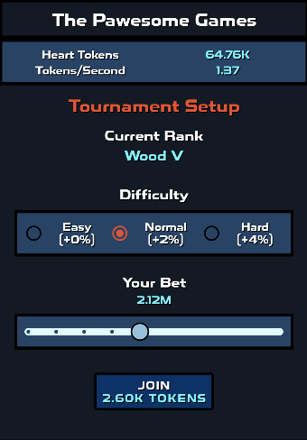
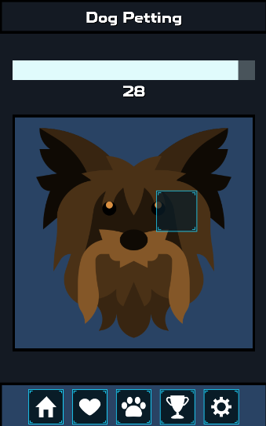
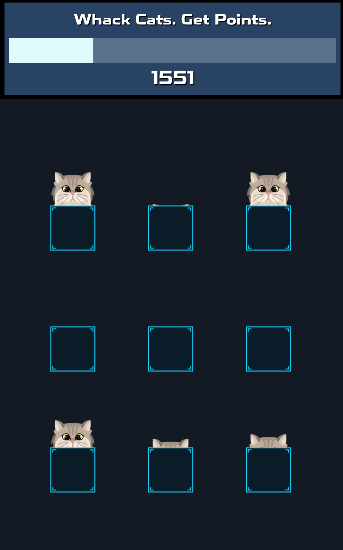
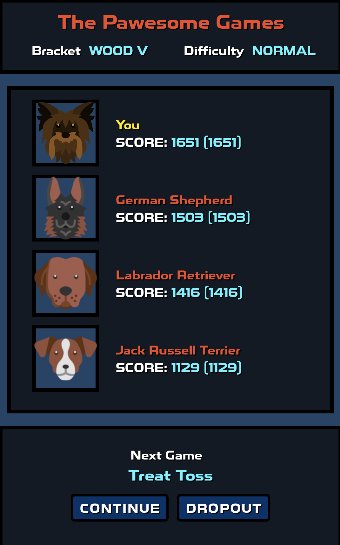
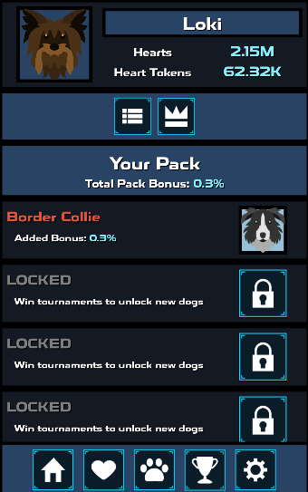
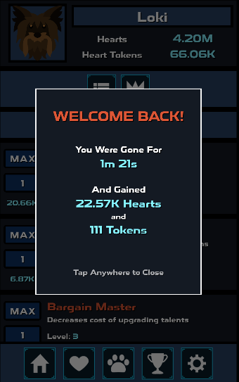

# project-yorkie

An Android mobile idle game where you strive to earn as many hearts as possible from loving your yorkie. 

## Features
- Gain hearts at an increasing rate
- Spend hearts on useful upgrade in the form of talents and bonuses
- Play a timing based minigame (petting your dog) to earn even more hearts
- Enter tournaments to battle other dogs and climb the ranks to become the best there is
- A good soundtrack as well as cute sounds, in the theme of dogs

## Screenshots

### Compete against AI to climb the Tournament ladder!

### Play fun minigames to earn more hearts!

### Try to beat your opponents whose difficulty only gets harder!

### Collect dogs after winning first place in the Tournament!

### Gain resources while offline - because I respect your time!

